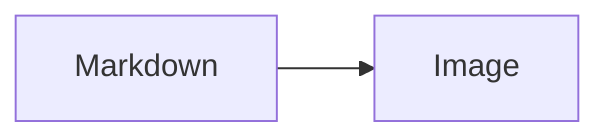
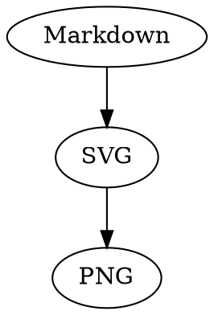

# MarkShot

MarkShot 是一款常驻 macOS 的 Markdown 阅读与分享工具。

MarkShot 把 Markdown 阅读和图片分享放在同一个工作台中：既可以粘贴一段内容即时预览、复制为长图，也可以打开本地 Markdown 文件进行只读阅读。预览是可选择文字的真实文档，只有复制或导出时才会生成图片。

当前开发版本：`v0.5.0`，仅提供 macOS Apple Silicon 构建。

## 界面原型

阅读与分享工作台的方案演进保存在 [`docs/prototype`](docs/prototype/README.md)。其中 `03-unified-reading-share.html` 是当前界面基线，其他编号文件用于追踪早期设计决策。

## 当前功能

- Markdown、纯文本和富文本预览
- 标题、列表、任务列表、表格、引用、代码高亮、脚注和安全 HTML
- 本地 Markdown 多文件打开、带视觉提示的窗口拖放打开、`Command+O` 与 Finder“打开方式”
- “打开 / 最近”互斥文档堆栈和外部修改实时刷新；最近最多保留 20 条，失效文件会被标记并可仅移除记录；侧栏文档可原生拖到聊天等外部应用
- “即时 / 阅读”独立状态，以及预览、双栏、源码三种只读视图
- 可选择文字的真实 DOM 预览，与最终图片共用渲染 HTML 和主题 CSS
- 移动端使用可滚动的手机外框预览，PC 使用桌面文档画布；设备外框不会进入最终图片
- 即时内容可通过原生保存对话框暂存为 UTF-8 Markdown
- 移动端与 PC 两种固定输出规格；PC 预览正文约 14 px，成图正文为 28 px
- 浅色、深色主题与多种图片背景
- 简体中文与英文界面，可在设置中即时切换并持久保存
- 图片标题和 MarkShot 页脚
- 图片复制与手动导出；超长内容会自动排成顶部对齐的 2–4 列，并合成为一张 PNG
- Mermaid、Markmap、Graphviz/DOT、Vega-Lite 与 ECharts 文本绘图
- 长图捕获失败自动重试，超过四列时明确提示并保留原剪贴板
- “快速截图”快捷键快速读取剪贴板并生成图片
- Dock 与菜单栏常驻
- UTF-8、UTF-16LE 和 UTF-16BE 文本识别

## 开发环境

- macOS
- Apple Silicon
- Node.js 20
- Electron 39
- Electron Forge 7

安装依赖并启动：

```bash
npm install
npm start
```

运行检查和测试：

```bash
npm run check
npm test
```

构建 Apple Silicon App：

```bash
npm run package:app
codesign --force --deep --sign - "out/MarkShot-darwin-arm64/MarkShot.app"
codesign --verify --deep --strict --verbose=2 "out/MarkShot-darwin-arm64/MarkShot.app"
```

## 发布

源码由 `main` 分支维护。编译后的 `.app`、ZIP 和 DMG 不提交到 Git 仓库；当前公开版本仍为 `v0.4.0`，本次 `v0.5.0` 先在开发分支验证：

- `MarkShot-v0.4.0-macOS-arm64.zip`：解压后直接获得 MarkShot.app
- `MarkShot-v0.4.0-macOS-arm64.dmg`：标准 macOS 磁盘映像

当前构建使用临时签名，尚未进行 Apple Developer ID 签名和公证。其他用户首次运行公开下载版本时，可能遇到 macOS Gatekeeper 提示。

## 文本绘图

在 Markdown 围栏代码块中使用以下语言标记即可生成离线静态 SVG，预览、复制和导出保持一致：

````text


```markmap
# MarkShot
## Preview
## Share
```



```vega-lite
{ mark: "bar", data: { values: [{ x: "A", y: 3 }] }, encoding: { x: { field: "x" }, y: { field: "y", type: "quantitative" } } }
```

```echarts
option = { xAxis: { data: ["A"] }, yAxis: {}, series: [{ type: "bar", data: [3] }] };
```
````

Vega-Lite 和 ECharts 支持安全 JSON5 配置，但不执行任意 JavaScript；远程数据、图片和脚本会被拒绝。单个图表可以通过顶层 `$markshot: { width, height }` 调整绘图尺寸，最终列宽仍由移动端或 PC 输出规格决定。

## 数据与隐私

MarkShot 默认在本地完成读取和渲染，不上传正文，不持久化即时内容、已打开文档正文、渲染 HTML、预览图片或图片历史。最近记录只保存最多 20 条文件路径和打开时间。只有用户主动保存即时文档或选择“导出图片”时才会写入文件。
