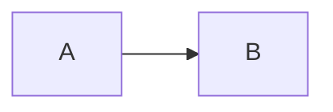
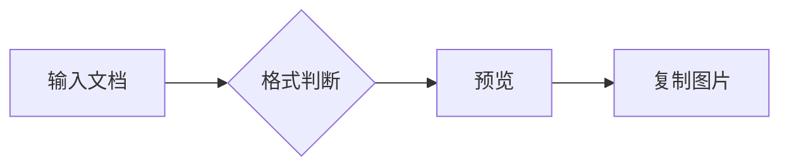
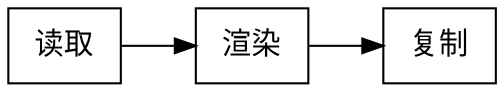

# MarkShot 常用格式与绘图验收

这份文档用于真实预览、搜索和截图验收。检查 PC / 移动端、浅色 / 深色，确保内容完整、图表文字可读。

## 01 正文与列表

中文 English 123，**加粗**、*斜体*、~~删除线~~、`inline_code`、[项目链接](https://github.com/Jady891213/markshot)。

1. 第一项
   - 嵌套列表
   - 第二项
2. 第二个步骤

- [x] 已完成任务
- [ ] 待处理任务

> 引用内容：图表和正文应该能完整复制。
>
> 第二段包含 **重点文字**。

## 02 代码围栏

```javascript
// 中文注释与语法高亮
const message = "你好 MarkShot";
async function greet(name) {
  return `${message}: ${name}`;
}
const longLine = "这一行很长，用于测试窄屏换行，不应该裁掉末尾内容。abcdefghijklmnopqrstuvwxyz0123456789ABCDEFGHIJKLMNOPQRSTUVWXYZ_末尾完整";
```

```python
def total(values: list[float]) -> float:
    """合计金额。"""
    return sum(values)
print(total([12.5, 30, 42]))
```

```sql
SELECT department, SUM(amount) AS total
FROM expenses WHERE year = 2026
GROUP BY department;
```

```json
{"name": "MarkShot", "enabled": true, "values": [1, 2, 3]}
```

~~~bash
echo "Hello Markdown"
~~~

```unknown-language
未知语言应保留原文 <tag> & symbols，不执行。
```

````markdown
以下是代码示例，不应渲染成图：

````

## 03 表格与脚注

| 名称（左对齐） | 状态（居中） | 金额（右对齐） |
| :--- | :---: | ---: |
| 软件工具 | 正常 | 1,234.50 |
| 中文与 English 混排 | 待处理 | 98.00 |

这里有一个脚注[^note]。

[^note]: 脚注应显示在文末，并支持返回。

## 04 公式与扩展格式探测

行内公式：$E = mc^2$。

$$
\sum_{i=1}^{n} x_i = \frac{n(n+1)}{2}
$$

> [!NOTE]
> GitHub 风格提示块：检查是否有专用样式。

<details open>
<summary>折叠内容标题</summary>

这里是展开内容，截图时不应遗漏。

</details>

## 05 Mermaid 流程图



## 06 Markmap 思维导图

```markmap
# 工作流程
## 输入
- Markdown 文件
- 剪贴板内容
## 输出
- 图片分享
- 本地阅读
```

## 07 Graphviz 关系图



## 08 Vega-Lite 柱状图

```vega-lite
{
  $markshot: {height: 300},
  data: {values: [{name: "一月", value: 28}, {name: "二月", value: 45}, {name: "三月", value: 36}]},
  mark: "bar",
  encoding: {x: {field: "name", type: "nominal"}, y: {field: "value", type: "quantitative"}}
}
```

## 09 ECharts 折线图

```echarts
{
  $markshot: {height: 300},
  xAxis: {type: "category", data: ["一月", "二月", "三月"]},
  yAxis: {type: "value"},
  series: [{type: "line", data: [28, 45, 36]}]
}
```

## 10 G2 柱状图

```g2
{
  $markshot: {height: 300},
  type: "interval",
  data: [{name: "一月", value: 28}, {name: "二月", value: 45}, {name: "三月", value: 36}],
  encode: {x: "name", y: "value", color: "name"},
  legend: false
}
```

## 11 G2 组合图

```g2
{
  $markshot: {height: 320},
  type: "view",
  data: [{month: "Q1", value: 30}, {month: "Q2", value: 55}, {month: "Q3", value: 42}],
  children: [
    {type: "line", encode: {x: "month", y: "value"}},
    {type: "point", encode: {x: "month", y: "value"}, style: {r: 5}}
  ]
}
```

## 12 嵌套绘图围栏

> ```mermaid
> graph LR
>   A[引用内图表] --> B[正常显示]
> ```

---

验收结束：正文、代码和图表均应保留中文文字，移动端不应裁切右侧内容。
